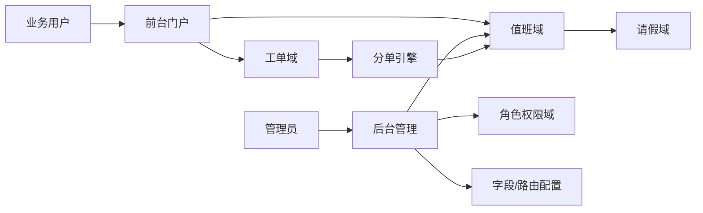

# GaussDB 运维系统设计文档（面向当前实现）

## 1. 文档定位

- 本文以当前代码实现为主，描述系统结构、关键机制和可扩展点
- 需求基线：`design/需求文档.md`
- 历史参考：`design/原始需求.md`（不作为当前实现验收口径）

## 2. 总体架构

当前技术选型：

- Django 单体应用
- SQLite 持久化
- 模块按应用划分：`accounts`、`rbac`、`scheduling`、`tickets`、`portal`

## 3. 领域模块设计

## 3.1 账号与身份（`accounts`）

- 基于 Django `User`
- 通过 `UserProfile.identities` 维护用户身份标签（可多身份）
- 预留对外账号体系接入（W3）

## 3.2 权限模型（`rbac`）

- `Permission`：权限点（如 `ticket:advance`）
- `Role`：角色与权限集合
- `UserRole`：用户-角色映射
- 权限校验入口：`rbac/services.py` 的 `has_permission`

说明：当前角色仍使用英文码（`pl/ops/dev/control/bu/guest`），界面展示支持中文姓名与身份标签。

## 3.3 排班与请假（`scheduling`）

核心实体：

- 轮值表与成员（白天）
- 值班表与日历排班（日夜/节假日）
- 身份路由规则 `IdentityRouteRule`（身份 + 时间窗口 -> 目标表）
- 请假申请 `LeaveRequest`

关键规则：

- 白天优先走轮值表，晚间/节假日走值班表
- 分单时跳过已审批请假人员
- 路由规则按优先级命中

## 3.4 工单流程（`tickets`）

七阶段状态机：

1. HCS提单
2. 问题审核
3. 运维人员分析
4. 开发人员分析
5. 开发人员审核
6. 运维人员闭环
7. 问题审核关闭

关键能力：

- 阶段推进、转派、字段编辑均受 RBAC 控制
- 阶段字段定义集中在 `tickets/stage_fields.py`
- 支持字段可见性/必填联动规则
- 记录流转日志 `TicketTransitionLog`

## 3.5 门户与页面（`portal` + `templates`）

- 首页：我的工单与概览
- 工单列表：我的待处理 / 我创建 / 全部 + 阶段筛选 + 关键字
- 工单详情：动态字段编辑、推进、转派
- 值班管理：月历展示、按值班表切换
- 统计分析：Dashboard 图表（人力投入、问题归属、透传、SLA、排班联动）
- 管理权限控制：仅管理员可编辑值班日历

## 4. 分单设计（当前实现）

分单入口：工单创建时（非自提单场景）。

输入：

- 提单时间
- 提单人身份（从 `UserProfile` 推断）
- 路由规则配置（身份与时间窗口）
- 当前可用排班成员（含请假过滤）

输出：

- 命中处理人（写入工单 `assignee`）

兜底策略：

- 未命中身份路由时，回退默认轮值/值班逻辑
- 候选为空时允许人工转派处理

## 5. 动态字段设计

- 字段定义结构：`key/label/widget/required/options/show_when/required_when`
- 渲染按阶段动态生成表单
- 服务端二次校验必填与联动规则，避免仅靠前端控制
- 字段值存于工单扩展数据，支持跨阶段展示

## 6. 管理能力设计

通过 Django Admin 提供：

- 用户、身份、角色、权限维护
- 轮值表、值班表、路由规则维护
- 请假审批与排班数据维护
- 工单与流转日志查询

补充：`is_staff` 用户可进入后台，且已处理后台模型操作权限问题。

## 7. 演示与初始化

- 迁移阶段写入基础 RBAC 角色权限
- `seed_demo_data` 提供演示账号、排班、路由与工单
- 详细示例见 `工具文档.md`

## 8. 统计分析模块（`analytics`）

- 路由：`/analytics/`
- 数据来源：`Ticket`、`TicketTransitionLog`、排班/请假数据
- 图表范围：人力投入、问题归属、透传分析、SLA趋势、排班联动
- 实现方式：后端聚合 + ECharts 渲染
- 权限：`dashboard:view`

## 9. 已实现与待扩展

### 9.1 已实现

- 七阶段流程闭环
- 动态字段（含联动）
- 自动分单 + 身份路由
- 月历值班与管理员编辑控制
- RBAC 基础能力
- Dashboard 统计分析
- 演示数据与中文姓名展示

### 9.2 待扩展

- 更完整的配置中心（主数据、选项集、发布回滚）
- 统计看板（SLA、透传率、人效等）
- W3 实际对接
- Doer 深度集成与自动化能力

## 10. 与原始需求关系

`design/原始需求.md` 保持历史底稿属性，不做同步改写。  
当前开发与验收以 `design/需求文档.md` 为准；原始需求中的扩展项作为后续迭代输入。
