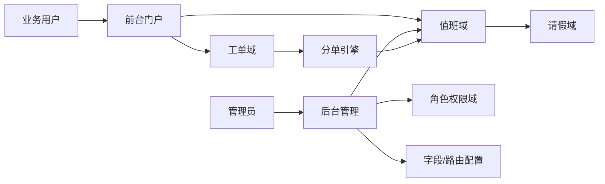

# GaussDB 运维系统设计文档（面向当前实现）

## 1. 文档定位

- 本文以当前代码实现为主，描述系统结构、关键机制和可扩展点
- 需求基线：`design/需求文档.md`
- 历史参考：`design/原始需求.md`（不作为当前实现验收口径）

## 2. 总体架构

当前技术选型：

- Django 单体应用
- SQLite 持久化
- 模块按应用划分：`accounts`、`rbac`、`scheduling`、`tickets`、`portal`

## 3. 领域模块设计

## 3.1 账号与资料（`accounts`）

- 基于 Django `User`
- `UserProfile.identities` 已废弃（仅历史兼容，不参与分单与权限判断）
- 预留对外账号体系接入（W3）

## 3.2 权限模型（`rbac`）

- `Permission`：权限点（如 `ticket:advance`） -- 废弃，仅保留阶段处理权限
- `Role`：角色与阶段处理权限集合
- `UserRole`：用户-角色映射
- `StagePermissionRule`：阶段处理权限规则（阶段 -> 角色）

说明：当前角色仍使用英文码（`pl/ops/dev/control/bu/guest`），界面展示支持中文姓名与角色标签。

## 3.3 排班与请假（`scheduling`）

核心实体：
- 在工单
- 轮值表与成员（工作日/月末周六 9:30--24：00）
- 值班表与日历排班（日夜/节假日 即上述之外的时间）
- 角色路由规则 `RoleRouteRule`（角色 + 时间窗口 -> 目标表）
- 请假申请 `LeaveRequest`

关键规则：
- 按时间走不同的表
- 分单时跳过已审批请假人员
- 路由规则按优先级命中
- 轮值表中人员优先级根据待处理工单的数量计算，工单多的优先级低。
- 值班表中人员的优先级根据当天非工作时间的接单数量排序。

## 3.4 工单流程（`tickets`）

八阶段状态机：

1. HCS提单
2. 问题审核
3. 运维人员分析
4. 开发人员分析
5. 开发人员闭环（`dev_review`，与字段表「开发人员闭环」列一致）
6. 运维人员闭环
7. 问题审核关闭
8. 问题单关闭

状态流转：
HCS提单 ->（选择审核人）问题审核
HCS提单 ->（撤回）撤销运维单
问题审核 ->(打回) HCS提单
问题单审核 ->（值班管理系统分配运维人员）运维人员分析
运维人员分析 ->（分配给其他用户） 运维人员分析
运维人员分析 ->（指定用户） 开发人员分析
运维人员分析 -> (运维人员闭环) 运维人员闭环
运维人员分析 ->（指定用户） 开发人员闭环
开发人员分析 -> (指定用户) 开发人员闭环
开发人员分析 -> (指定用户) 开发人员分析
开发人员闭环 -> (指定用户) 运维人员闭环
运维人员闭环 -> (指定用户) 问题审核关闭
问题审核关闭 -> 问题单关闭
问题审核关闭 ->（指定用户）运维人员闭环

阶段处理权限： 工单处理中前7个阶段分别对应7个权限，只有拥有对应权限的人才可以被指定进入到对应的权限。指定或者分配用户的时候就只能选优目标阶段处理权限的人。
一个角色可以对应多个阶段处理权限。
如果是走回上一个状态，则选择用户的时候默认为上一个状态对应的用户
新增：工单的每个状态仅对于一个当前处理人。只有工单的当前处理人才可以操作工单。
新增：除了走向问题单关闭状态和撤销运维单，其他状态必须有对应的用户处理

## 3.5 门户与页面（`portal` + `templates`）

- 首页：待处理的工单、我创建的工单、我过协助的工单
- 工单列表：我的待处理 / 我创建 / 我协助的 / 全部 + 阶段筛选 + 关键字
- 工单详情：？？？ 
- 值班管理：值班表、轮值表（通过日历展示）
- 统计分析：Dashboard 图表（人力投入、问题归属、透传、SLA、排班联动）
- 管理权限控制：仅管理员可编辑值班日历

## 4. 分单设计（与值班系统）

### 4.1 原则

- **仅在为工单首次进入「运维人员分析」阶段时**，由**值班管理系统**（轮值表 / 值班表 + 角色路由）自动指定当前处理人。  
  典型路径：**问题审核** 经处理方式流转至 **运维人员分析**；以及 **运维自提单** 在建单时直接进入 **运维人员分析**（同样走值班分单）。
- **进入其他阶段**（如问题审核、开发分析、闭环、审核关闭等）的当前处理人，一律由上一阶段的操作人在界面 **「处理方式 + 下一处理人」** 中显式指定；**不调用**值班分单引擎。
- **同一阶段内转派 / 「提交其他运维人员分析」等仍停留在运维分析** 时，由人工选择同阶段有权限的处理人，**不调用**值班分单。

### 4.2 输入与数据源

| 输入 | 说明 |
|------|------|
| 分单时刻 | 工单 `stage` 刚从非「运维人员分析」变为「运维人员分析」的那次流转（或自提单建单完成瞬间） |
| 角色集合 | 默认取 **提单人** `UserRole`，用于命中 `RoleRouteRule`（角色 + 时间窗口 → 轮值表或值班表） |
| 时间窗口 | 与 `scheduling.services` 一致：工作日白天可走轮值；夜间/节假日走当日值班表（见排班模块实现） |

### 4.3 输出与失败策略

- **输出**：写入工单 `assignee`；在 `TicketTransitionLog` 中记录说明（含「值班表/轮值表」「命中路由」等摘要）。
- **失败**：若轮值表与值班表均无可用人员（含全员请假等），则**本次流转失败**并提示「值班系统暂无可派运维人员」，工单仍停留在原阶段，由管理员调整排班或人工介入。

### 4.4 候选排序（与 3.3 对齐）

- **轮值表**：在候选成员中按「进行中单据数 `active_ticket_count` 升序」等规则排序，**单量多的优先级更低**（实现见 `pick_assignee` / `RotaMember`）。
- **值班表**：按排班条目顺序迭代；若在模型中落地「非工作时段接单计数」字段，可进一步按当天夜间接单量排序（当前未实现的指标可在迭代中补全）。

### 4.5 与 RBAC 的关系

- 自动派中的人选必须已具备 **运维人员分析** 阶段处理能力（`can_handle_stage`）；值班成员与阶段权限配置应在排班与角色上一致。
- 工单 **仅当前处理人** 可执行推进、回退、转派、改字段等操作（管理员后台数据维护除外）。

## 5. 动态字段设计

- 字段定义结构：`key/label/widget/required/options/show_when/required_when`
- 渲染按阶段动态生成表单
- 服务端二次校验必填与联动规则，避免仅靠前端控制
- 字段值存于工单扩展数据，支持跨阶段展示

## 6. 管理能力设计

通过 Django Admin 提供：

- 用户、角色、权限维护
- 轮值表、值班表、路由规则维护
- 请假审批与排班数据维护
- 工单与流转日志查询

补充：`is_staff` 用户可进入后台，且已处理后台模型操作权限问题。

## 7. 演示与初始化

- 迁移阶段写入基础 RBAC 角色权限
- `seed_demo_data` 提供演示账号、排班、路由与工单
- 详细示例见 `工具文档.md`

## 8. 统计分析模块（`analytics`）

- 路由：`/analytics/`
- 数据来源：`Ticket`、`TicketTransitionLog`、排班/请假数据
- 图表范围：人力投入、问题归属、透传分析、SLA趋势、排班联动
- 运维效率重点：模块 SLA、人员 SLA、运维独立问题闭环率、开发问题闭环率
- 实现方式：后端聚合 + ECharts 渲染
- 权限：登录用户可查看（不依赖 Permission 模块）

## 9. 已实现与待扩展

### 9.1 已实现

- 八阶段流程闭环（含问题单关闭终态）
- 动态字段（含联动）
- 值班分单**仅在进入运维人员分析**时触发；其余阶段人工指定处理人
- 月历值班与管理员编辑控制
- RBAC 基础能力
- Dashboard 统计分析
- 演示数据与中文姓名展示

### 9.2 待扩展

- 更完整的配置中心（主数据、选项集、发布回滚）
- 统计看板（SLA、透传率、人效等）
- W3 实际对接
- Doer 深度集成与自动化能力
- 媒体资源访问控制（当前 DEBUG 本地直出，仅演示用途）

## 10. 与原始需求关系

`design/原始需求.md` 保持历史底稿属性，不做同步改写。  
当前开发与验收以 `design/需求文档.md` 为准；原始需求中的扩展项作为后续迭代输入。
